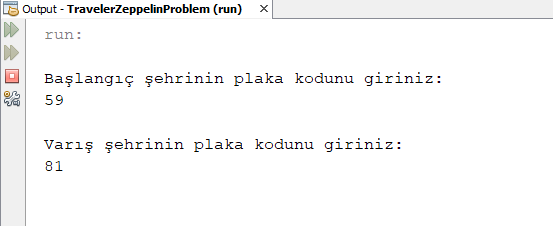
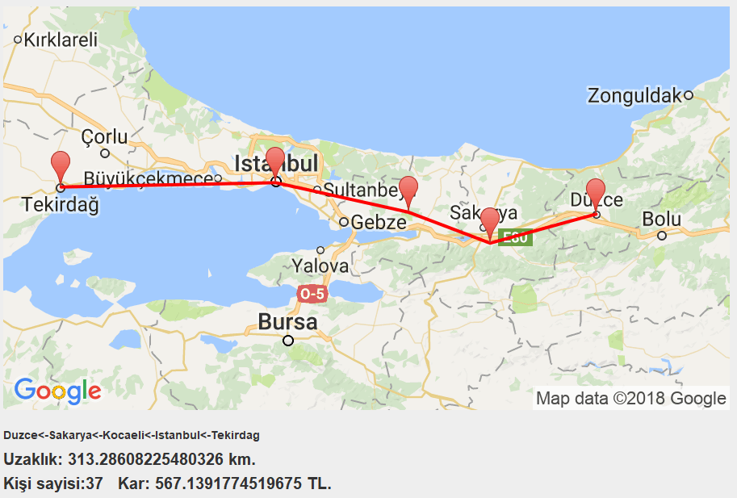

# Traveller Zeppelin Problem

## Description
This project; the start and end cities find the shortest cost route between the two cities, taken by the user, and calculates the angle for all the neighbors of the cities on these roads and calculates whether to go to the relevant city by comparing these angles with the number of passengers in the zeppelin. As a result of these accounts, we requested this project; The problem of obtaining maximum profit by taking a flat fee and the price of fifty percent profit from a passenger is solved. All these steps are requested from us in the project; It is solved according to the characteristics of the airship vehicle.

## Dependency

This program uses Google Static Map API and their dependencies.

## Usage

Clone and run with NetBeans IDE, but first you need to get an api key from Google Static Map service and change with "urlString" variable (Line: 124) in /src/travelerzeppelinproblem/FiftyPercentProfitProblem.java file.

## Contributing
Pull requests are welcome. For major changes, please open an issue first to discuss what you would like to change.

Please make sure to update tests as appropriate.

## Authors
:bust_in_silhouette: [Mehmet Fırat KÖMÜRCÜ](https://github.com/MehmetFiratKomurcu)

:bust_in_silhouette: [Ali Recep KARACA](https://github.com/recepkaraca)

## Project Status

This is our school project.